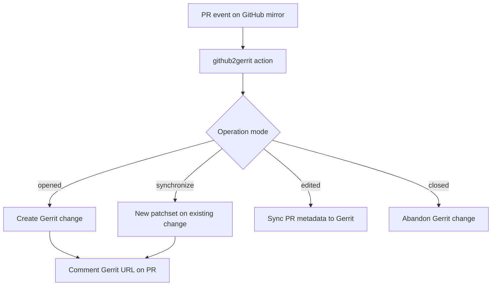

<!--
SPDX-License-Identifier: Apache-2.0
SPDX-FileCopyrightText: 2025 The Linux Foundation
-->

# github2gerrit

Mirror GitHub pull requests into Gerrit changes.

github2gerrit serves projects where Gerrit is the source of truth and
GitHub hosts a read-only mirror. Automation tools such as Dependabot
raise pull requests against the GitHub mirror; this action translates
those pull requests into Gerrit changes, keeping the two systems in
sync across the entire lifecycle: creation, updates/rebases, metadata
edits, closure, and cleanup.

The implementation is a Python CLI tool (`github2gerrit`, published to
PyPI) wrapped in a GitHub composite action, plus a reusable workflow
for straightforward deployment in consuming repositories.

## Goals and purpose

- Let Gerrit-based projects receive dependency updates (Dependabot)
  and other automated changes raised against a GitHub mirror.
- Keep GitHub PRs and Gerrit changes synchronized in both directions:
  PR updates become new patchsets, merged/abandoned changes close
  their source PRs, and closed PRs abandon their Gerrit changes.
- Avoid duplicate Gerrit changes through Change-Id reuse and
  reconciliation when automation rebases or re-raises PRs.

## How it works



In more detail, a run:

1. Reads PR context and inputs; detects the operation mode
   (CREATE, UPDATE, EDIT, CLOSE) from the triggering event.
2. Reads `.gitreview` for the Gerrit host, port, and project
   (or uses explicit `GERRIT_SERVER` / `GERRIT_PROJECT` inputs).
3. Sets up git and SSH for Gerrit, derives missing credentials from
   the organization name where possible.
4. Prepares commits: squashed single commit (default), one-by-one
   cherry-picks (`SUBMIT_SINGLE_COMMITS`), or PR title/body as the
   commit message (`USE_PR_AS_COMMIT`). Reuses existing Change-Id
   trailers on updates so pushes create new patchsets, not new
   changes.
5. Pushes to `refs/for/<branch>` with a Gerrit topic derived from the
   project and PR number (prefix configurable via `G2G_TOPIC_PREFIX`,
   default `GH`), queries Gerrit for the resulting URL/number/SHA, and
   cross-links: a back-reference comment in Gerrit and the change
   URL(s) on the PR.

See [docs/features.md](docs/features.md) for detailed feature
documentation: PR update handling, comment commands, duplicate
detection, reconciliation, cleanup, commit normalization,
configuration precedence, and credential derivation.

## Quick start

### Prerequisites

- A Gerrit account for the automation user, with SSH access and
  permission to push to `refs/for/*` on the target project.
- The SSH private key stored as a repository or organization secret:
  `GERRIT_SSH_PRIVKEY_G2G`.
- A `.gitreview` file in the repository (recommended). Without it,
  pass `GERRIT_SERVER`, `GERRIT_SERVER_PORT`, and `GERRIT_PROJECT`
  explicitly.
- Optional repository/organization variables: `GERRIT_KNOWN_HOSTS`,
  `GERRIT_SSH_USER_G2G`, `GERRIT_SSH_USER_G2G_EMAIL`. The tool
  derives missing values from the organization name and populates
  known hosts automatically on first run.

### Option A: reusable workflow (recommended)

Add a thin caller workflow to the consuming repository:

```yaml
# .github/workflows/github2gerrit.yaml
name: github2gerrit

on:
  pull_request_target:
    types: [opened, reopened, edited, synchronize, closed]
  push:
    branches: [main, master]
  workflow_dispatch:
    inputs:
      PR_NUMBER:
        description: "PR number to process; 0 processes all open"
        required: false
        default: "0"
        type: string

permissions: {}

jobs:
  github2gerrit:
    permissions:
      contents: read
      pull-requests: write
      issues: write
    # yamllint disable-line rule:line-length
    uses: lfreleng-actions/github2gerrit-action/.github/workflows/github2gerrit.yaml@main
    with:
      GERRIT_KNOWN_HOSTS: ${{ vars.GERRIT_KNOWN_HOSTS }}
      GERRIT_SSH_USER_G2G: ${{ vars.GERRIT_SSH_USER_G2G }}
      GERRIT_SSH_USER_G2G_EMAIL: ${{ vars.GERRIT_SSH_USER_G2G_EMAIL }}
      PR_NUMBER: ${{ inputs.PR_NUMBER || '0' }}
    secrets:
      GERRIT_SSH_PRIVKEY_G2G: ${{ secrets.GERRIT_SSH_PRIVKEY_G2G }}
```

The `push` trigger enables closing PRs whose Gerrit changes have
merged; `workflow_dispatch` enables manual processing. Repositories
using the Gerrit-side dispatch integration should also declare
`GERRIT_CHANGE_URL`, `GERRIT_EVENT_TYPE`, and `GERRIT_BRANCH` as
dispatch inputs and forward them the same way.

Pin `@main` to a release tag or commit SHA for production use.

### Option B: composite action

Call the action directly for full control over all inputs:

```yaml
name: github2gerrit

on:
  pull_request_target:
    types: [opened, reopened, edited, synchronize, closed]
  workflow_dispatch:

permissions:
  contents: read
  pull-requests: write
  issues: write

jobs:
  submit-to-gerrit:
    runs-on: ubuntu-latest
    steps:
      - name: Submit PR to Gerrit
        id: g2g
        uses: lfreleng-actions/github2gerrit-action@main
        with:
          GERRIT_KNOWN_HOSTS: ${{ vars.GERRIT_KNOWN_HOSTS }}
          GERRIT_SSH_PRIVKEY_G2G: ${{ secrets.GERRIT_SSH_PRIVKEY_G2G }}
          GERRIT_SSH_USER_G2G: ${{ vars.GERRIT_SSH_USER_G2G }}
          GERRIT_SSH_USER_G2G_EMAIL: ${{ vars.GERRIT_SSH_USER_G2G_EMAIL }}
```

### Option C: command-line tool

The underlying Python CLI supports local and ad-hoc use (for example,
processing a single PR URL or bulk-processing a repository). This is
a secondary use case; see [docs/cli.md](docs/cli.md).

```bash
uvx github2gerrit https://github.com/onap/portal-ng-bff/pull/33
```

## Action inputs

<!-- markdownlint-disable MD013 -->

| Input                       | Required | Default          | Description                                                    |
| --------------------------- | -------- | ---------------- | -------------------------------------------------------------- |
| `GERRIT_SSH_PRIVKEY_G2G`    | Yes      | —                | SSH private key content used to authenticate to Gerrit         |
| `GERRIT_KNOWN_HOSTS`        | No       | —                | Known hosts entries for Gerrit SSH (auto-populated when empty) |
| `GERRIT_SSH_USER_G2G`       | No       | `""`             | Gerrit SSH username; derived when not supplied                 |
| `GERRIT_SSH_USER_G2G_EMAIL` | No       | `""`             | Gerrit user email address; derived when not supplied           |
| `GERRIT_SERVER`             | No       | `""`             | Gerrit server hostname; `.gitreview` preferred                 |
| `GERRIT_SERVER_PORT`        | No       | `"29418"`        | Gerrit SSH port                                                |
| `GERRIT_PROJECT`            | No       | `""`             | Gerrit project name; `.gitreview` preferred                    |
| `GERRIT_HTTP_BASE_PATH`     | No       | `""`             | HTTP base path for Gerrit REST API (e.g. `/r`)                 |
| `GERRIT_HTTP_USER`          | No       | `""`             | Gerrit HTTP user for REST queries                              |
| `GERRIT_HTTP_PASSWORD`      | No       | `""`             | Gerrit HTTP password/token for REST queries                    |
| `ORGANIZATION`              | No       | repository owner | GitHub organization/owner used for credential derivation       |
| `PR_NUMBER`                 | No       | `"0"`            | PR number to process; `0` processes all open PRs (dispatch)    |
| `FETCH_DEPTH`               | No       | `"10"`           | Fetch depth for checkout                                       |
| `SUBMIT_SINGLE_COMMITS`     | No       | `"false"`        | Submit one commit at a time to Gerrit                          |
| `USE_PR_AS_COMMIT`          | No       | `"false"`        | Use PR title and body as the commit message                    |
| `PRESERVE_GITHUB_PRS`       | No       | `"true"`         | Do not close GitHub PRs after pushing to Gerrit                |
| `CLOSE_MERGED_PRS`          | No       | `"true"`         | Close GitHub PRs when their Gerrit change merges               |
| `CLEANUP_ABANDONED`         | No       | `"true"`         | Close GitHub PRs for abandoned Gerrit changes                  |
| `CLEANUP_GERRIT`            | No       | `"true"`         | Abandon Gerrit changes when their GitHub PR closes             |
| `CREATE_MISSING`            | No       | `"false"`        | Create a new change when UPDATE finds no existing change       |
| `ALLOW_DUPLICATES`          | No       | `"true"`         | Allow submitting duplicate changes without error               |
| `DUPLICATE_TYPES`           | No       | `"open"`         | Comma-separated Gerrit states checked for duplicates           |
| `AUTOMATION_ONLY`           | No       | `"true"`         | Accept PRs from known automation tools only                    |
| `NORMALISE_COMMIT`          | No       | `"false"`        | Normalize commit messages to conventional commit format        |
| `COMMIT_RULES_JSON`         | No       | `""`             | JSON commit message validation rules (see docs)                |
| `ISSUE_ID`                  | No       | `""`             | Issue ID trailer to include (e.g. `ABC-123`)                   |
| `ISSUE_ID_LOOKUP_JSON`      | No       | `"[]"`           | JSON array mapping GitHub actors to Issue IDs                  |
| `REVIEWERS_EMAIL`           | No       | `""`             | Comma-separated reviewer emails                                |
| `DRY_RUN`                   | No       | `"false"`        | Check settings and PR metadata; do not write to Gerrit         |
| `FORCE`                     | No       | `"false"`        | Force PR closure regardless of Gerrit change status            |
| `G2G_USE_SSH_AGENT`         | No       | `"true"`         | Use SSH agent instead of file-based keys                       |
| `G2G_NO_GERRIT`             | No       | `"false"`        | Run the pipeline without contacting Gerrit (forces dry-run)    |
| `G2G_DISABLED`              | No       | `""`             | Kill switch: skip all processing when `true`                   |
| `ALLOW_GHE_URLS`            | No       | `"false"`        | Allow GitHub Enterprise URLs in direct URL mode                |
| `VERBOSE`                   | No       | `"false"`        | Verbose output (sets log level to DEBUG)                       |
| `CI_TESTING`                | No       | `"false"`        | CI testing mode; overrides `.gitreview`                        |
| `USE_LOCAL_ACTION`          | No       | `"false"`        | Use local repository code instead of the PyPI package          |

<!-- markdownlint-enable MD013 -->

Every input maps to an environment variable of the same name
(`VERBOSE` maps to `G2G_VERBOSE`), and most have matching CLI
flags. Reconciliation tuning (`SIMILARITY_SUBJECT`,
`SIMILARITY_UPDATE_FACTOR`, `SIMILARITY_FILES`, `REUSE_STRATEGY`) is
available through environment variables and CLI flags only; set these
via `env:` on the action step when needed. See
[docs/cli.md](docs/cli.md) for the full option reference and
[docs/features.md](docs/features.md) for feature-specific settings.

## Action outputs

<!-- markdownlint-disable MD013 -->

| Output                      | Description                                |
| --------------------------- | ------------------------------------------ |
| `gerrit_change_request_url` | Gerrit change URL(s), newline-separated    |
| `gerrit_change_request_num` | Gerrit change number(s), newline-separated |
| `gerrit_commit_sha`         | Patch set commit SHA(s), newline-separated |

<!-- markdownlint-enable MD013 -->

Access outputs in later steps with
`${{ steps.<step-id>.outputs.<output-name> }}`. The reusable workflow
re-exports all three outputs to callers.

## Reusable workflow interface

The reusable workflow (`.github/workflows/github2gerrit.yaml`) wraps
the composite action for `workflow_call`, supporting caller triggers
`pull_request_target`, `push` (close PRs for merged Gerrit changes),
and `workflow_dispatch` (manual runs and Gerrit-event dispatches).
Input defaults match the composite action defaults.

<!-- markdownlint-disable MD013 -->

| Input                       | Type    | Default          | Description                                      |
| --------------------------- | ------- | ---------------- | ------------------------------------------------ |
| `GERRIT_KNOWN_HOSTS`        | string  | `""`             | Known hosts entries for Gerrit SSH               |
| `GERRIT_SSH_USER_G2G`       | string  | `""`             | Gerrit SSH username                              |
| `GERRIT_SSH_USER_G2G_EMAIL` | string  | `""`             | Gerrit user email address                        |
| `GERRIT_SERVER`             | string  | `""`             | Gerrit server hostname                           |
| `GERRIT_SERVER_PORT`        | string  | `"29418"`        | Gerrit SSH port                                  |
| `GERRIT_PROJECT`            | string  | `""`             | Gerrit project name                              |
| `GERRIT_HTTP_BASE_PATH`     | string  | `""`             | HTTP base path for Gerrit REST                   |
| `GERRIT_HTTP_USER`          | string  | `""`             | Gerrit HTTP user for REST queries                |
| `GERRIT_HTTP_PASSWORD`      | string  | `""`             | Gerrit HTTP password/token for REST queries      |
| `G2G_USE_SSH_AGENT`         | boolean | `true`           | Use SSH agent instead of file-based keys         |
| `ORGANIZATION`              | string  | repository owner | GitHub organization/owner                        |
| `PR_NUMBER`                 | string  | `"0"`            | PR to process on dispatch; `0` processes all     |
| `FETCH_DEPTH`               | string  | `"10"`           | Fetch depth for checkout                         |
| `SUBMIT_SINGLE_COMMITS`     | boolean | `false`          | Submit one commit at a time                      |
| `USE_PR_AS_COMMIT`          | boolean | `false`          | Use PR title and body as the commit message      |
| `PRESERVE_GITHUB_PRS`       | boolean | `true`           | Do not close GitHub PRs after pushing            |
| `CLOSE_MERGED_PRS`          | boolean | `true`           | Close GitHub PRs when their Gerrit change merges |
| `CLEANUP_ABANDONED`         | boolean | `true`           | Close GitHub PRs for abandoned Gerrit changes    |
| `CLEANUP_GERRIT`            | boolean | `true`           | Abandon Gerrit changes when their PR closes      |
| `CREATE_MISSING`            | boolean | `false`          | Create a change when UPDATE finds none           |
| `AUTOMATION_ONLY`           | boolean | `true`           | Accept PRs from known automation tools only      |
| `NORMALISE_COMMIT`          | boolean | `false`          | Normalize commit messages                        |
| `COMMIT_RULES_JSON`         | string  | `""`             | JSON commit message validation rules             |
| `ALLOW_DUPLICATES`          | boolean | `true`           | Allow submitting duplicate changes               |
| `DUPLICATE_TYPES`           | string  | `"open"`         | Gerrit states checked for duplicates             |
| `FORCE`                     | boolean | `false`          | Force PR closure regardless of change status     |
| `VERBOSE`                   | boolean | `false`          | Verbose output (DEBUG log level)                 |
| `ALLOW_GHE_URLS`            | boolean | `false`          | Allow GitHub Enterprise URLs                     |
| `DRY_RUN`                   | boolean | `false`          | Check only; do not write to Gerrit               |
| `ISSUE_ID`                  | string  | `""`             | Issue ID trailer to include                      |
| `ISSUE_ID_LOOKUP_JSON`      | string  | `"[]"`           | JSON array mapping GitHub actors to Issue IDs    |
| `REVIEWERS_EMAIL`           | string  | `""`             | Comma-separated reviewer emails                  |
| `GERRIT_CHANGE_URL`         | string  | `""`             | Gerrit change URL from a Gerrit event dispatch¹  |
| `GERRIT_EVENT_TYPE`         | string  | `""`             | Gerrit event type (e.g. `change-merged`)¹        |
| `GERRIT_BRANCH`             | string  | `""`             | Target branch override (Gerrit event dispatch)¹  |

| Secret                   | Required | Description                                    |
| ------------------------ | -------- | ---------------------------------------------- |
| `GERRIT_SSH_PRIVKEY_G2G` | Yes      | SSH private key for the Gerrit automation user |

| Output                      | Description                                |
| --------------------------- | ------------------------------------------ |
| `gerrit_change_request_url` | Gerrit change URL(s), newline-separated    |
| `gerrit_change_request_num` | Gerrit change number(s), newline-separated |
| `gerrit_commit_sha`         | Patch set commit SHA(s), newline-separated |

<!-- markdownlint-enable MD013 -->

¹ Gerrit → GitHub reverse flow: when Gerrit-side automation
dispatches the caller workflow to report a merged or abandoned
change, forward these dispatch inputs and the tool closes the source
GitHub PR instead of processing pull requests.

Setting the repository variable `G2G_NO_GERRIT` to `true` makes runs
skip Gerrit interaction. Test-only settings (`CI_TESTING`,
`USE_LOCAL_ACTION`) remain composite-action-only by design.

## Documentation

<!-- markdownlint-disable MD013 -->

| Document                                     | Contents                                                                                                                    |
| -------------------------------------------- | --------------------------------------------------------------------------------------------------------------------------- |
| [docs/features.md](docs/features.md)         | Feature reference: PR updates, comment commands, cleanup, duplicate detection, reconciliation, normalization, configuration |
| [docs/cli.md](docs/cli.md)                   | CLI installation, options, environment variables, exit codes, debugging                                                     |
| [docs/COMMIT_RULES.md](docs/COMMIT_RULES.md) | Commit message validation rules and `COMMIT_RULES_JSON` format                                                              |
| [docs/development.md](docs/development.md)   | Contributor guide: local setup, testing, composite action test suite                                                        |

<!-- markdownlint-enable MD013 -->

## Security notes

- Do not hardcode secrets or keys. Provide the private key through
  workflow secrets and known hosts through repository or organization
  variables.
- SSH handling is non-invasive: the tool creates temporary SSH files
  in the workspace without modifying user SSH configuration or keys,
  and cleans them up after execution.
- SSH connections use `IdentitiesOnly=yes` to avoid unintended key
  usage (e.g. signing keys requiring biometric authentication).

## License

Apache License 2.0. See [LICENSE](LICENSE).
